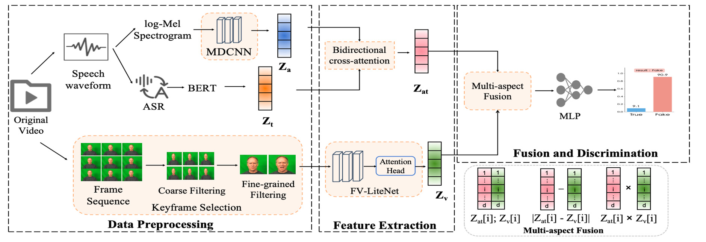

# ACE-Net Architecture

Architecture of the ACE-Net baseline (Yu et al., *Electronics* 2025, 14, 4420),
mapped to this repository's implementation. Figure 1 presents the forward
architecture. Section 4 documents the two-stage training procedure implemented
in `src/train_*.py`.

---

## 1. Overall architecture (paper Figure 1)



The forward pipeline comprises three stages, left to right:

| Block (in figure) | Role | Output |
|---|---|---|
| **Data Preprocessing** | log-Mel from speech, ASR→BERT for text, coarse→fine keyframe selection for video | mel spectrogram, text tokens, K keyframes |
| **Feature Extraction** | MDCNN (audio) + BERT (text) → bidirectional cross-attention → `Z_at`; FV-LiteNet + attention head → `Z_v` | `Z_at ∈ R^d`, `Z_v ∈ R^d` |
| **Fusion & Discrimination** | multi-aspect fusion of `Z_at`, `Z_v` → MLP → real/fake | probability `p` |

`d = 256` (shared embedding width).

---

## 2. Feature extraction branches

### 2.1 Speech–Text branch → `Z_at`

```
speech ─► log-Mel ─► MDCNN ──► Z_a ┐
                                   ├─► Bidirectional cross-attention ─► Z_at
text  ─► ASR ─► BERT ──► Z_t ──────┘
```

- **MDCNN** (`src/models/mdcnn.py`): depthwise-separable conv backbone with a
  parallel channel + spatial attention module; produces the acoustic token
  sequence `Z_a`.
- **BERT** (frozen) encodes the ASR transcript into `Z_t`.
- **Bidirectional cross-attention** (`src/models/cross_attention.py`): acoustic
  queries attend to text and vice-versa; the two directions are mean-pooled over
  time and summed into the joint speech-text embedding `Z_at`.

Assembled in `src/models/speech_text.py`.

### 2.2 Visual branch → `Z_v`

```
video ─► frame sequence ─► coarse filter (optical-flow motion gate)
      ─► fine filter (expressiveness score) ─► K keyframes
      ─► FV-LiteNet (GhostNet) ─► Attention Head ─► Z_v
```

- **Keyframe selection**: coarse motion gating then fine expressiveness scoring
  pick the K (=8) most emotionally salient frames (done in preprocessing; the
  per-frame attention weights α are stored alongside the frames).
- **FV-LiteNet** (`src/models/fv_litenet.py`): GhostNet backbone (SE removed in
  the last two stride-2 bottlenecks), a final 1×1 conv to C_v = 960, and the
  Figure-4b spatial-channel **attention head**. Per-frame embeddings are
  attention-pooled with the stored α weights and projected to `Z_v`.

---

## 3. Fusion & discrimination

```
            ┌─ concat:  [Z_at ; Z_v]
Z_at, Z_v ──┼─ diff:    |Z_at − Z_v|     ──► f ∈ R^{4d} ──► MLP (512→128→1) ──► p
            └─ product:  Z_at ⊙ Z_v
```

`src/models/fusion.py` — the **multi-aspect fusion** (shown bottom-right of the
figure) builds a 4·d vector from concatenation, element-wise absolute
difference, and element-wise product, then a 3-layer MLP (BatchNorm + Dropout)
outputs the consistency probability. Large `|Z_at − Z_v|` ⇒ cross-modal
inconsistency ⇒ likely forgery.

Full forward assembly: `src/models/acenet.py`.

---

## 4. Training procedure

ACE-Net is trained in **two decoupled stages** (paper §3.5).

```
┌─────────────────────────── STAGE 1 ───────────────────────────┐
│  Train the unimodal extractors as EMOTION classifiers,         │
│  on GENUINE data only, each in its own label space:            │
│                                                                │
│    MDCNN+cross-attn ─► emotion head   (src/train_stage1.py     │
│    FV-LiteNet       ─► emotion head     --branch speech_text|visual)
│                                                                │
│  CREMA-D (6-class) and MELD (7-class) trained separately.      │
│  Loss: cross-entropy.  Then FREEZE both extractors.            │
└────────────────────────────────────────────────────────────────┘
                                │  (frozen Z_at, Z_v)
                                ▼
┌─────────────────────────── STAGE 2 ───────────────────────────┐
│  Freeze extractors; train ONLY the fusion + MLP discriminator. │
│  (src/train_stage2.py)                                         │
│                                                                │
│  Negative (label 0): genuine aligned audio-visual pairs        │
│  Positive (label 1): forgeries, 50/50 split of                 │
│        P1 Emotion-Tampering  +  P2 Cross-Identity-Splice       │
│  1:1 genuine:fake balance.  Loss: BCE.                         │
│                                                                │
│  Split is GROUP-AWARE by source actor so no clip/speaker       │
│  leaks across train/val/test.                                  │
└────────────────────────────────────────────────────────────────┘
```

**Why two stages:** Stage 1 grounds the feature spaces in *authentic* emotion on
genuine data; freezing prevents the extractors from learning synthesis
artifacts. Stage 2 then only has to learn the *consistency* decision on top of
those fixed embeddings.

### Evaluation
- **Stage 1** → paper Tables 2/3: Accuracy, Weighted-F1, per-class P/R/F1,
  confusion matrix (`src/eval_stage1.py`).
- **Stage 2** → paper Table 4: per forgery type — ACC, Precision, Recall, F1,
  AUC (`src/eval_stage2.py`).
- All metrics on the held-out **10%** test split of an 80/10/10 partition.

---

## 5. Repository map

| Figure block | Code |
|---|---|
| MDCNN | `src/models/mdcnn.py` |
| Bidirectional cross-attention | `src/models/cross_attention.py` |
| Speech-Text branch (`Z_at`) | `src/models/speech_text.py` |
| FV-LiteNet + attention head (`Z_v`) | `src/models/fv_litenet.py` |
| Multi-aspect fusion + MLP | `src/models/fusion.py` |
| Full model | `src/models/acenet.py` |
| Stage-1 / Stage-2 training | `src/train_stage1.py`, `src/train_stage2.py` |
| Evaluation | `src/eval_stage1.py`, `src/eval_stage2.py` |
| Data loading / split | `src/data/`, `src/train_utils.py` |

See [ACE-Net.md](ACE-Net.md) for the full paper notes and equations, and
[../FIDELITY.md](../FIDELITY.md) for known deviations.
